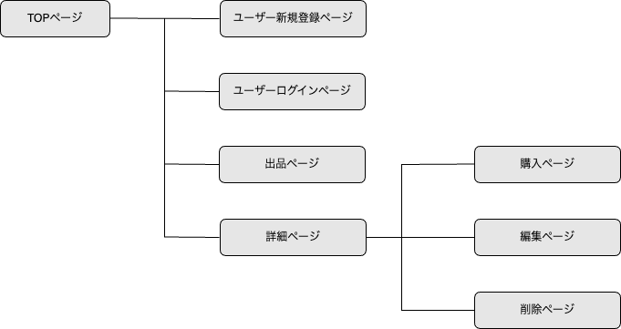

# アプリケーション名
フリマーケットアプリ拡張版

# アプリケーション概要
テックキャンプで学習後に制作したフリマアプリを拡張。  
基本的な出品・購入・ログイン機能に加え、ユーザー体験や検索利便性、品質向上を意識して下記機能を追加しました。  

【追加した機能】
- 検索機能(キーワード検索とカテゴリー検索)
- 出品機能（カテゴリ選択・タグ追加）
- 画像プレビュー機能（編集画面でも切り替え可能）
- コメント機能（非同期通信、Action Cableでリアルタイム共有）
- バリデーション（カテゴリー必須、検索やタグ、コメントの文字数制限など）

【元々の機能】
- 出品機能
- 商品一覧表示機能
- 商品詳細表示機能
- 商品情報編集機能
- 商品削除機能
- 商品購入機能(PAY.jpのクレジットカード決済を実装)

# URL
https://furima-41561.onrender.com/
# テスト用アカウント
- Basic認証ID : tecfurima
- Basic認証パスワード : 58476
# 追加実装した機能についての画像やGIFおよびその説明

## 検索機能(キーワード検索とカテゴリー検索)
- キーワード検索とカテゴリー検索の組み合わせで商品を絞り込みも可能
- 使用技術 Ransack・JavaScript

## 出品・編集画面に可変式カテゴリー選択欄（親→子→孫）を実装
- 使用技術 JavaScript

## 出品・編集画面にタグのインクリメンタルサーチ機能を実装
- 使用技術 JavaScript

## 出品・編集画面の画像プレビュー機能（変更時にプレビューが切り替わる）
- 使用技術 JavaScript

## コメント機能（Action Cableでリアルタイム共有）
- 使用技術 Action Cable・JavaScript

## コメント機能で投稿者以外に不要なエラーが表示されないようAJAXで制御
- 使用技術 JavaScript

## バリデーションメッセージを日本語化
- 使用技術 I18n

# 実装予定の機能
- カテゴリー検索機能に、子・孫カテゴリーを追加
- 価格検索機能を追加
- 結合テストの実装

# データベース設計

# 画面遷移図

# 開発環境
- フロントエンド
- バックエンド
- インフラ
- テスト
- テキストエディタ
- タスク管理

# ローカルでの動作方法
- 以下のコマンドを順に実行。
- git clone https://github.com/masaki-tec/furima-41561.git
- bundle install
- rails db:create
- rails db:migrate
- rails db:seed
- rails s

# 工夫したポイント

## 1. 検索機能の拡張
- キーワード検索（商品名・説明文・タグ・出品者名）を追加
- カテゴリー検索（親カテゴリ選択）を追加
- 検索条件の組み合わせで商品を絞り込める

## 2. 出品・編集画面の改善
- 画像プレビュー機能を実装（変更時にプレビューが切り替わる）
- 可変式カテゴリー選択（親→子→孫）を実装
- 任意でタグを追加可能（文字数制限・重複禁止を実装）
- タグのインクリメンタルサーチを実装

## 3. バリデーション・エラーメッセージ
- 全モデル・全画面でバリデーションを実装
- バリデーションメッセージを日本語化（I18n対応）
- ユーザーが直感的に入力エラーを理解できる工夫

## 4. コメント機能
- Action Cableでリアルタイム更新を実装
- 投稿者以外に不要なエラーが表示されないようAJAXで制御

## 5. 品質管理
- RSpecでモデル・機能単位のテストを作成
- テストコードも日本語化して可読性を向上

## 技術スタック
- Ruby on Rails, PostgreSQL, Active Storage, Action Cable
- Ransack（検索機能）
- I18n（日本語化）
- RSpec（テスト）
- JavaScript / Ajax（非同期処理）

# 今後の改善点
- 出品画面でバリデーションエラーメッセージの後、可変式カテゴリーとタグのインクリメントサーチが表示されるよう修正
- 編集画面でバリデーションエラーメッセージの後、タグのインクリメントサーチが表示されるよう修正

# 制作時間
2ヶ月